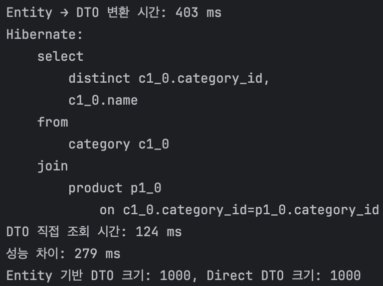

## REVIEW

### Domain

#### Product 생성 시 Category 연관관계 설정 로직 개선

**문제**
 Product 생성 시 Category 정보가 단순 문자열로만 표현되어, 확장성이 떨어짐

**개선안**
- Category를 엔티티로 분리하여 상태와 식별자를 가질 수 있도록 개선함
- Product 생성 시 Category 엔티티를 참조하도록 하여 도메인 간 관계를 명확히 표현함

### Controller

#### RESTful API 설계 원칙 위반

**문제**
 
HTTP Method와 URI 설계가 RESTful 원칙에 맞지 않게 작성되어 있음  
예를 들어, 자원 삭제 기능에 DELETE 대신 POST를 사용하는 등 자원과 행위가 혼용되어 있음  
또한 메서드명에 by 등의 행위 표현이 포함되어 URI 일관성이 떨어짐

**개선안**
- GET /categories/{categoryId}/products - 특정 카테고리의 상품 조회로 일관성 유지
- GET /categories - 카테고리 목록 자체를 조회

    Trade-Off
    put(전체 수정) vs patch(일부 수정)
    일부 수정에도 PUT 선택한 이유 : 클라이언트 - 서버간 데이터 전달에 일관성을 유지하기 위해 선택

#### HTTP 응답 상태 코드 일관성 부족

**문제**
  모든 API가 ResponseEntity.ok()로 반환
  특히, createProduct()와 같은 요청의 경우 201 Created를 반환해야 하나, 200 OK로 처리되어 RESTful 규칙에 어긋남

**개선안**
- 201 Created 상태 코드와 함께 생성된 리소스의 URI 반환
- 조회, 수정, 삭제 등 행위별로 적절한 상태 코드 사용

#### Entity를 직접 반환하고 있음

**문제**
  
Entity -> JSON 변환 시 Product(1) → Category(N) → Product(1) 순으로 순환 참조가 발생할 수 있음

**개선안**
 
Entity 대신 DTO를 반환하도록 수정하여, 필요한 데이터만 반환

#### 메서드 네이밍이 객체지향적이지 않음

**문제**
  
메서드명이 단순히 데이터 접근에 초점 맞춰져 있음

**개선안**
 
메서드 명을 도메인 행위 중심의 표현으로 개선

### DTO

#### DTO 설계 방식 개선

**문제**
 단순 데이터 전달용 DTO임에도 일반 class로 작성되어
필드, 생성자, getter 등 불필요한 코드가 반복되고 있음

**개선안**
- record를 사용하여 데이터 전달 역할에 집중하도록 개선
- 불변성을 보장하여 코드의 간결성과 유지보수성을 높임

### 성능 개선

#### Repository Entity -> DTO 바로 반환
  

**테스트 시나리오**
- 1,000개 Category, 각 Category당 10개 Product
- Category 엔티티를 조회 후 CategoryDto 변환 -> 수행 시간 기록
- JPQL에서 DTO를 바로 select → 수행 시간 기록

**테스트 결과**
- Entity 기반 조회: 평균 403ms
- DTO 직접 조회: 평균 124ms

